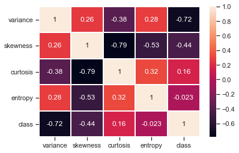
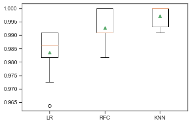

## How to experimentally determine which machine learning algorithm, out of many, performs better than the rest?

This question can be resolved using hypothesis testing which can be used to determine the statistical significance of the results obtained. In this project, several classifiers have been trained on the bank note authentication dataset to determine which model performs better over the others, considering that the metrics alone cannot be used to determine a model's generalization capabilities. 

- **Dataset** : [Link](https://archive.ics.uci.edu/ml/datasets/banknote+authentication) to the dataset that consists of quantitative features extracted from images of authentic and forged/fraudulent bank notes. 

- **Algorithms Used** : Logistic Regression, KNN and Random Forest Classifier

- **Data Preprocessing** : Features have been normalized and no missing values are present.

- **Initial Results**

**Algorithm** | **Mean Accuracy (%)** |
------------ | ------------- |
Logistic Regression | 98.3
Random Forest Classifier| 99.27
K-Nearest Neighbors | 99.72

**Performance comparison of three algorithms** 

- **Hypothesis Testing** : Comparing 2 models at a time, hypothesis testing has been performed using the Paired t-test to determine the statistical significance of the results obtained. 

**Algorithms** | **t-statistic** | **p-value** |
------------ | ------------- | ----------------
Log Reg and RFC | -1.345 | 0.236
RFC and KNN | 2.335 | 0.067
KNN and Log Reg | 3.777 | 0.013 | 

- **Interpretation of Results**

These experiments have been conducted assuming a significance level of 0.05 and when the p-value < 0.05, the null hypothesis can be rejected.
This only applies to Case 3 where the mean accuracies of KNN and Logistic Regression have been compared and a p-value of 0.013 is obtained. Hence, in this case, the results indicate that there is a statistically significant difference between the performance of the models and that one model (KNN) performs better on the dataset.
